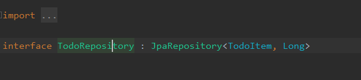
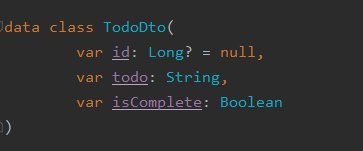
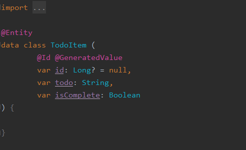
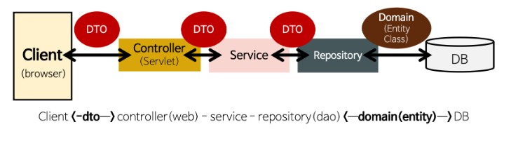

DAO, DTO, Entity
================

## DAO

#### DAO 란, 실제 DB 에 접근하는 Layer 로, 기본적인 DB 와의 CRUD 작업이 구현되어 있는 Layer 다.

* 보통 DTO 를 인자로 받아, ToEntity() 메소드를 통하여, Entity 로 변환 후, DB 관련 작업 수행
* 반환해야 할 값이 있다면, Entity 를 다시 ToDto() 메소드를 퉁하여, DTO Layer 변환 후, 반환해주는 역할을 한다.

***

## DTO

#### DTO 란, Layer 간 데이터 교환을 위한 객체로, Service 에서 DAO 계층과 상호할 때, DTO 를 통하여 데이터를 주고 받는다.

* 주로, 로직을 갖고 있지 않은, 순수하게 get, set 으로만 구성된 객체이다.
* Controller Layer 에선, Client 에게 Response DTO 형태로 Response 를 내려준다.

***

## Entity

#### Entity 란, 실제 DB 스키마와 매칭될 클래스이다.

* 가장 core 한 클래스로, 실제 DB 의 스키마와 매칭되고, ToDto() 메소드르 통하여, Service Layer 에 데이터를 전달한다.

***

## 정리

#### 아래와 같은 흐름도를 가지면서, 데이터 교환이 일어난다고 보면 된다.

