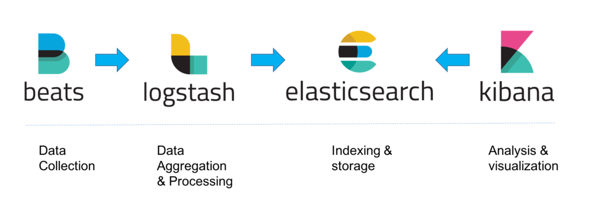

# ELK Stack

## 배경
요즘, 다수의 애플리케이션이 분산되어 있는 시점에서, 직접 로그 관리 툴을 설계하고, 관리한다는 것은 어려운 일입니다. 

이 때, ELK Stack 은 개발자들에게 조금 더 편리한 환경에서 로그 수집 및 모니터링을 할 수 있게끔 지원해줍니다.

***

## 구성
ELK Stack 은 Elastic Search, Logstash, Kibana 의 앞글자를 딴 것으로, 여기에 Beats 까지 합쳐져 ELK Stack 으로 불리우고 있습니다.

각각의 스펙의 대해서는 따로 문서를 정리할 예정입니다.

우선 간단한 서비스의 기능을 소개하겠습니다.

### Elastic Search
아파치 루씬 기반 분산 검색 엔진으로, Logstash, Filebeat 를 통해 들어온 데이터를 저장 및 분석하는 서비스입니다.

쉽게 DB 라고 생각하면 될 것 같습니다. (실제 RDS 와는 조금 다른 구성과 검색 엔진을 가지고 있지만요....)

***

### LogStash
Filebeat 로부터 수신된 데이터를 수집 및 변환하여 Elastic Search 로 전송하는 역할을 합니다.

이 때, 인덱싱을 통하여, Kibana 에서 데이터를 보는 데에 조금 더 편리함을 줄 수 있습니다.

***

### Kibana
Elastic Search 에 저장된 데이터를 볼 수 있는 시각화 도구

다양한조건들을 통하여, 추출된 데이터를 깔끔한 시각화를 통하여 쉽게 파악이 가능합니다.

쉽게 말해, Elastic Search (DB) 에 있는 데이터를 볼 수 있는 Html, Js 페이지라고 생각하시면 됩니다.

***

### Filebeat
각 애플리케이션마다 발생한 로그 / 로그 파일들을 경량화하여 Logstash 나 Elastic Search 에 전송하는
시스템입니다.

***

## 문제 상황 및 예상 방안

ELK 를 사용하면서 발생했던 문제 상황들과 아직 도입하지는 않았지만, 예상되는 해결 방안들을 적어보았습니다.

### 문제 상황

간혹, 애플리케이션의 로그가 갑자기 많이 추가될 경우나 잘못된 인덱싱 처리가 발생할 경우,
Logstash 컨테이너가 제대로 작동하지 못하게 됩니다.

Logstash 에 문제가 생기면, Elastic Search, Kibana 서비스들도 구동하지 않겠죠?

***

### 해결 방안

필자가 생각하는 해결 방안들은 아래와 같습니다.

- 로그의 Level 을 분리합니다. Product 환경에서는 꼭 필요한 Warning, Error 로그만 저장하고, Debug 로그 레벨의 경우는 Dev 환경에서만 저장하여 모니터링합니다.

- Logstash 컨테이너를 적절한 애플리케이션 그룹별로 분리하여 관리합니다.

- Elastic Search 의 Default Field 수는 1000 개이므로, 이 이상으로 많아질 것 같은 경우, 미리 Field 수를 늘려놓고, 진행합니다.

*** 

## 정리

회사에서 ELK Stack 을 사용중이었지만 간혹, 발생하는 이슈들때문에 공수가 조금 들긴 하였지만, 직접 구축하는 것에 비하면 훨씬 노고를 덜은 편인 것 같습니다.

추후에는 위 ELK Stack 의 각 서비스들에 조금 더 디테일한 포스팅을 다루려고 합니다. (config file 등..)