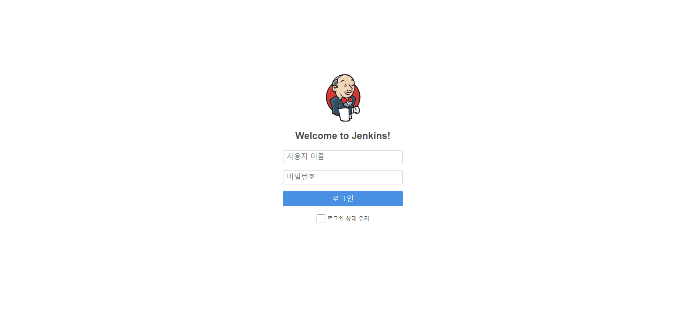
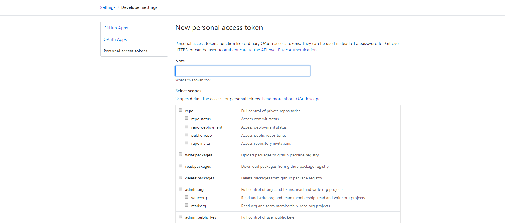
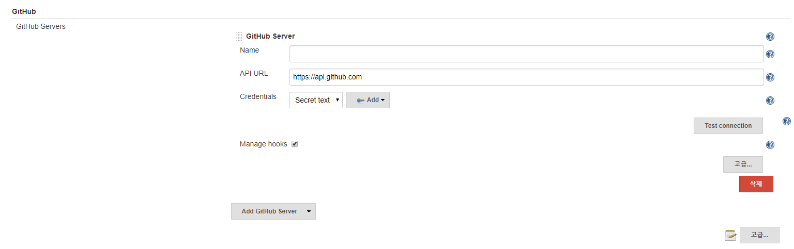
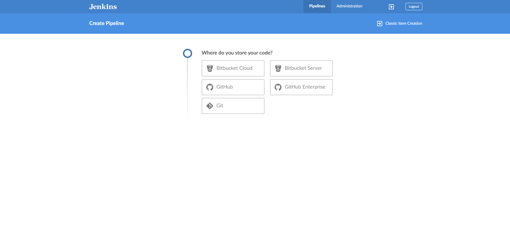
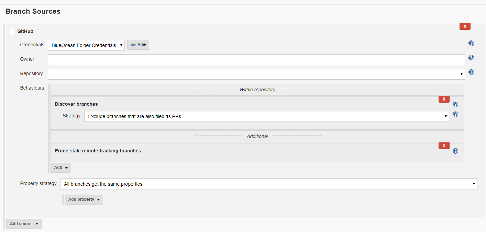
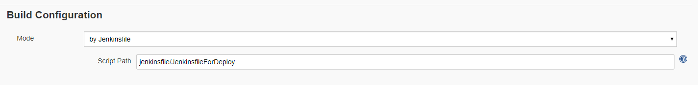

## Jenkins 시작하기

***

### Download Jenkins image and start

필자는 ec2 (linux centos 환경) 에 jenkins 서버를 구축하였다.

먼저, 인스턴스에 jenkins image 를 pull 받는다.

```docker pull jenkins/jenkins```

그 다음, 젠킨스 서버 컨테이너를 구동시킨다.

```docker run -d -p 8080:8080 ${jenkins_image}```

그 다음, 해당 인스턴스의 endpoint 로 접속하면, 경로를 주어주면서, credential password 를 입력하라 나옵니다.

해당 경로로 접속한 다음, password 를 입력하면 jenkins 스타트 !




그 다음, 처음 볼 때에는 이게 무슨 UI 라고 할 수 있다싶이한 페이지가 나옵니다. 

우선 jenkins 와 github 을 연동하여 사용하려면 조금 세팅해야될 부분이 있어 간단하게 설명하고 넘어가겠습니다.

***

### Create Github Access Token

이후 Credential 에 필요한 Github Access Token 을 발급받아야 합니다.

Github Login -> Settings -> Developer settings -> Personal access tokens -> Generate new token



원하는 조건을 선택하여 토큰을 발급하시면 됩니다.

***

### Download plugin

CI / CD 연동에 필요한 플러그인을 다운받아야 합니다. 아래 몇 가지 필자가 사용했던 플러그인들을 정리해보았습니다.

* blue ocean plugin download : 기존 괴팍한 UI 대신, 조금 더 깔끔하게 파이프라인 생성에 용이한 UI 를 제공해주는 플러그인입니다.

* github pull request builder plugin download : PR Open 시, CI / CD 작업을 처리할 때 편리하게 사용할 수 있는 builder 플러그인입니다.

* etc... anything you need : 다른 AWS Contact Pulgin 등등 연동 시 필요한 플러그인을 다운받으시면 됩니다.

***

### Set github server configuration

jenkins 서버와 github api 서버를 연동해야 하는데, 이는 jenkins 관리 /  시스템 설정 탭에서 설정할 수 있습니다.



먼저, Credential 을 생성 (Add 버튼 클릭 후, Kind 를 Secret Text 로 설정 후, 깃헙에서 발급받은 access token 입력)

Credential 을 통해 api server 테스트 후, 연동

***

### Open blue ocean and create pipeline

Blue Ocean 탭으로 접속합니다.

그럼 처음 파이프라인을 생성하라는 메세지가 나올텐데, 생성 버튼을 누르고, 사용할 소스 형상 관리 툴을 선택합니다.



다음, 파이프라인을 구축할 repository 를 선택 후, 아까 발급받은 access token 을 입력해주면 끝 ! 이 아니라...

***

### Set pipeline configuration

언제 CI / CD 가 Hook 될 것인지, 설정하는 란이 필요합니다.

해당 파이프라인에서 톱니바퀴를 클릭하면, 구 UI 로 넘어가면서 설정 페이지가 열립니다.

이 때, Branch Source 란을 본인의 레포와 맞춰주시고,



아래 Build_Configuration 에 groovy 형식으로 작성된 jenkinsfile 의 위치를 맵핑시켜주면 됩니다.



***

### Test pipeline

그 다음, 잘 작동하는지 확인하기 위해, 코드를 변경하고, 해당 파이프라인을 빌드합니다.

Jenkins file 작성법, CD Pipeline (dockerfile + dockeraws.run.json + jenkinsfile) 에 대한 자세한 내용은 다음 포스팅에 업데이트하겠습니다.
